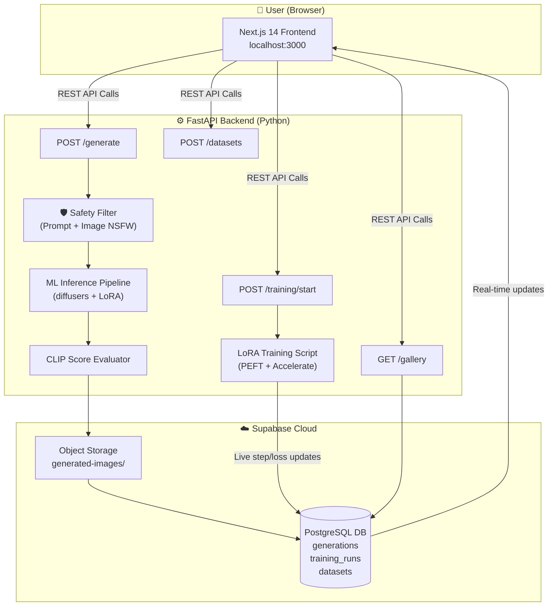
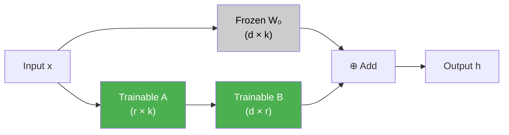
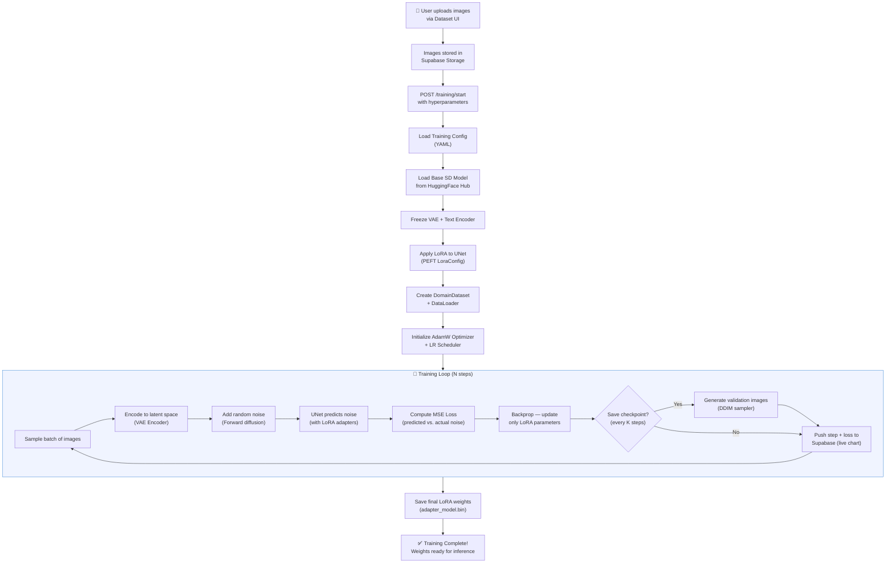
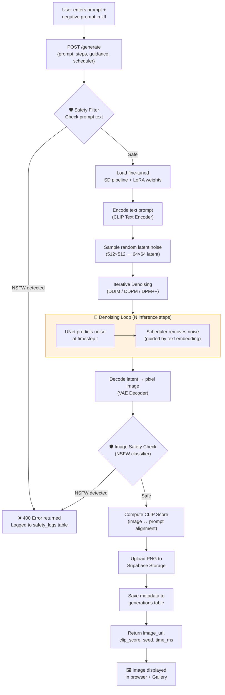
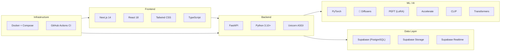
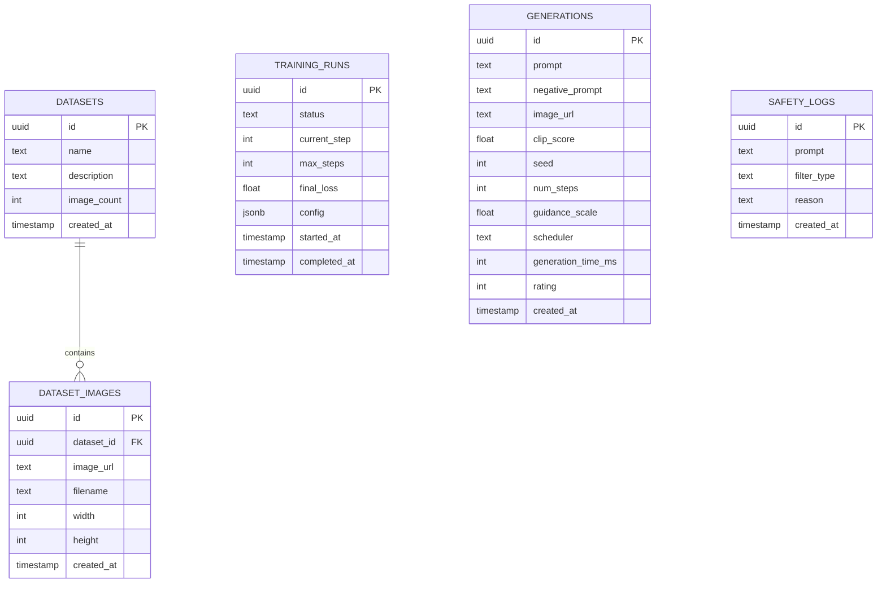

<p align="center">
  <h1 align="center">🎨 Diffusion Fine-tuning Platform</h1>
  <p align="center">
    A research-grade, full-stack platform for fine-tuning Stable Diffusion models on custom datasets using LoRA — with a live web UI, REST API, and cloud database.
  </p>
  <p align="center">
    
    
    
    
    
    
  </p>
</p>

---

## 📌 Table of Contents

- [What This Project Is](#-what-this-project-is)
- [Why We Built It](#-why-we-built-it)
- [What We Improved](#-what-we-improved)
- [System Architecture](#-system-architecture)
- [How LoRA Works — The Theory](#-how-lora-works--the-theory)
- [Training Pipeline Flowchart](#-training-pipeline-flowchart)
- [Generation Pipeline Flowchart](#-generation-pipeline-flowchart)
- [Features](#-features)
- [Tech Stack](#-tech-stack)
- [Project Structure](#-project-structure)
- [How to Run on Your PC](#-how-to-run-on-your-pc)
- [Environment Variables](#-environment-variables)
- [API Reference](#-api-reference)
- [Database Schema](#-database-schema)
- [Troubleshooting](#-troubleshooting)
- [Acknowledgements](#-acknowledgements)

---

## 🧠 What This Project Is

The **Diffusion Fine-tuning Platform** is a complete, end-to-end system that lets you:

1. **Upload a small custom image dataset** (e.g., faces, artistic styles, products)
2. **Fine-tune a Stable Diffusion model** on that dataset using **LoRA** (Low-Rank Adaptation) — requiring only a fraction of GPU memory compared to full fine-tuning
3. **Generate new images** from text prompts using your fine-tuned model, directly from a web browser
4. **Evaluate and compare** generated images using automated metrics (CLIP scores) and a community rating system
5. **Manage everything** via a polished Next.js dashboard — no command-line required after initial setup

This is **not** just a training script. It's a fully integrated product with a backend API, a frontend UI, cloud storage, a real-time database, and safety filters — all wired together and deployable with a single command.

---

## 💡 Why We Built It

Training generative AI models is powerful but historically required deep ML expertise and command-line tools. Our goal was to **democratize Stable Diffusion fine-tuning** by:

- Wrapping the complexity of `diffusers` + `PEFT` into a clean REST API
- Creating a beautiful, intuitive frontend for non-technical users
- Providing **real-time training progress** via live logs and database sync
- Making model evaluation as simple as clicking a star rating

The core research problem: *How do you adapt a billion-parameter diffusion model to a new visual domain with only 20–30 images and a consumer GPU?* The answer is **LoRA**.

---

## 🚀 What We Improved

Compared to vanilla LoRA training scripts and the original project skeleton, the following major improvements were made:

| Area | Before | After (This Project) |
|------|--------|----------------------|
| **Training feedback** | Silent terminal output | Real-time log streaming via SSE + Supabase sync |
| **Loss tracking** | Final loss only | Per-step loss, smoothed EMA loss, gradient norm, step-time |
| **Logging frequency** | Fixed N-step interval | **Adaptive log frequency** — always ≥ 20 data points on the chart, regardless of training length |
| **Dataset upload** | Manual file copying | Browser-based batch upload with image preview |
| **Image generation** | Run inference script manually | One-click generation from web UI with scheduler choice (DDIM/DDPM/DPM++) |
| **Safety** | None | Dual-layer safety filter: prompt-level + image-level NSFW detection |
| **Evaluation** | No metrics | Automatic CLIP score per generation + community star ratings |
| **Portability** | Single script | Docker Compose + `start.sh` one-liner for local dev |
| **Apple Silicon** | Crashes on MPS | Auto-detects MPS and disables `mixed_precision` to prevent `autocast` errors |
| **Gallery** | No storage | All generated images stored in Supabase Storage with full metadata |

---

## 🏗️ System Architecture



---

## 📐 How LoRA Works — The Theory

### What is LoRA?

**Low-Rank Adaptation (LoRA)** is a Parameter-Efficient Fine-Tuning (PEFT) technique. Instead of updating all weights in a giant model, LoRA **freezes** the original weights and injects small **trainable rank-decomposition matrices** alongside them.

### The Mathematics

Given a pretrained weight matrix **W₀ ∈ ℝᵈˣᵏ**, LoRA represents the weight update as:

```
W = W₀ + ΔW = W₀ + B·A

Where:
  B ∈ ℝᵈˣʳ   (down-projection)
  A ∈ ℝʳˣᵏ   (up-projection)
  r << min(d, k)   (rank, typically 4–32)
```



### Why LoRA vs Full Fine-tuning?

| Metric | Full Fine-tuning | LoRA (This Project) |
|--------|:--------------:|:------------------:|
| Parameters Updated | 100% (~860M) | ~0.5–2% (~4M) |
| GPU VRAM Required | 24–80 GB | **8–12 GB** |
| Training Time | Hours–Days | **Minutes–Hours** |
| Risk of Catastrophic Forgetting | 🔴 High | 🟢 Minimal |
| Model Artifact Size | ~4 GB | **~100 MB** |
| Works on Consumer GPU | ❌ No | ✅ Yes |

In this implementation, LoRA adapters are added **only to the UNet** attention layers (`to_q`, `to_k`, `to_v`, `to_out`). The VAE encoder and CLIP text encoder remain **fully frozen**.

---

## 🔄 Training Pipeline Flowchart



---

## ⚡ Generation Pipeline Flowchart



---

## ✨ Features

### 🎯 Training Pipeline
- **LoRA Fine-tuning** via `PEFT` library — only 0.5–2% of parameters trained
- **Custom Dataset Support** — upload any domain-specific images via the UI
- **Real-time Progress** — live training log streaming (SSE) + Supabase step/loss sync
- **Adaptive Log Frequency** — automatically ensures ≥ 20 chart data points regardless of training length
- **EMA Loss Smoothing** — exponential moving average for a clean loss curve
- **Gradient Norm Tracking** — monitor training stability
- **Automatic Checkpoints** — LoRA weights saved every N steps
- **Validation Image Generation** — sample images from the model mid-training
- **Apple Silicon Support** — auto-detects MPS and disables `mixed_precision` to avoid crashes
- **xFormers Support** — optional memory-efficient attention for large batch training

### 🖼️ Image Generation
- **Text-to-Image** generation from any prompt
- **Negative Prompt** support to exclude unwanted concepts
- **Guidance Scale Control** — balance between prompt adherence and creativity
- **Scheduler Choice** — DDPM, DDIM, or DPM++ 
- **Seed Control** — reproducible generations
- **Dual-Layer Safety Filtering** — prompt text + generated image both checked

### 📊 Evaluation & Gallery
- **CLIP Score** — automatic alignment metric between image and prompt
- **Community Ratings** — star rating system on any gallery image
- **Side-by-Side Comparison** — base model vs. fine-tuned model output
- **Full Metadata Storage** — every generation tracked (prompt, seed, steps, guidance, time)

### 🗂️ Dataset Management
- **Batch Upload** — upload multiple images at once via the browser
- **Image Preview Grid** — browse your dataset with instant previews
- **Optimistic UI Updates** — newly uploaded images appear immediately without refresh
- **Automatic Preprocessing** — images resized and center-cropped during training

---

## 🛠️ Tech Stack



| Layer | Technology |
|-------|------------|
| **Frontend** | Next.js 14, React 18, Tailwind CSS, TypeScript |
| **Backend** | FastAPI, Python 3.10+, Uvicorn |
| **ML Framework** | PyTorch, HuggingFace Diffusers, PEFT |
| **Training Utilities** | Accelerate (multi-GPU/MPS), OmegaConf, xFormers |
| **Text Encoding** | CLIP (OpenAI) via `transformers` |
| **Database** | Supabase (PostgreSQL) |
| **Storage** | Supabase Storage (S3-compatible) |
| **Deployment** | Docker, Docker Compose |

---

## 📁 Project Structure

```
diffusion-finetune/
│
├── 📂 backend/                          # FastAPI Python backend
│   ├── 📂 api/
│   │   ├── main.py                     # App entry point, pipeline loader
│   │   ├── 📂 routes/
│   │   │   ├── generate.py            # POST /generate — image generation
│   │   │   ├── training.py            # POST /training/start|stop|status
│   │   │   ├── gallery.py             # GET /gallery — browse generations
│   │   │   ├── metrics.py             # GET /metrics — training stats
│   │   │   ├── datasets.py            # Dataset CRUD + image upload
│   │   │   └── evaluation.py          # Model evaluation endpoints
│   │   └── 📂 middleware/
│   │       └── safety.py              # Dual-layer NSFW safety filter
│   │
│   ├── 📂 ml/
│   │   ├── train_lora.py              # ⭐ Main LoRA training script
│   │   ├── inference.py               # Inference pipeline (generate images)
│   │   ├── dataset.py                 # DomainDataset — image loading + augmentation
│   │   └── evaluate.py                # CLIP score computation
│   │
│   ├── 📂 models/
│   │   └── lora_weights/              # Saved LoRA adapter checkpoints
│   │
│   ├── 📂 configs/
│   │   └── training_config.yaml       # All hyperparameters in one place
│   │
│   ├── 📂 data/
│   │   └── domain_images/             # Your training images go here
│   │
│   └── requirements.txt               # Python dependencies
│
├── 📂 frontend/                         # Next.js 14 frontend
│   ├── 📂 app/
│   │   ├── page.tsx                   # Home dashboard
│   │   ├── 📂 training/               # Start/monitor training runs
│   │   ├── 📂 generate/               # Text-to-image generation UI
│   │   ├── 📂 gallery/                # Browse + rate generated images
│   │   ├── 📂 datasets/               # Upload + manage datasets
│   │   └── 📂 evaluation/             # Side-by-side model evaluation
│   │
│   ├── 📂 components/                  # Reusable UI components
│   ├── 📂 lib/                         # API client utilities
│   └── package.json
│
├── 📂 images/                           # Documentation images
├── supabase_schema.sql                  # Full DB schema (run this first!)
├── docker-compose.yml                   # One-command Docker deployment
├── start.sh                             # Quick local dev start script
├── .env.local                           # Frontend environment vars (template)
└── .env.backend                         # Backend environment vars (template)
```

---

## 💻 How to Run on Your PC

### Prerequisites

Make sure you have the following installed:

| Tool | Minimum Version | Check Command |
|------|----------------|---------------|
| Python | 3.10+ | `python --version` |
| Node.js | 18+ | `node --version` |
| npm | 9+ | `npm --version` |
| Git | Any | `git --version` |
| CUDA GPU | Optional (recommended) | `nvidia-smi` |

> **Note:** The backend will start without a GPU, but image generation will be disabled. A CUDA GPU (8 GB+ VRAM) is required for training and inference. Apple Silicon (MPS) is also supported.

---

### Step 1 — Clone the Repository

```bash
git clone https://github.com/Akkii88/Diffusion-finetuneLLM.git
cd Diffusion-finetuneLLM/diffusion-finetune
```

---

### Step 2 — Set Up Supabase

1. Go to [supabase.com](https://supabase.com) and create a free project
2. Open the **SQL Editor** in your Supabase dashboard
3. Paste and run the entire contents of `supabase_schema.sql`
4. In **Storage → Buckets**, create a public bucket called `generated-images`
5. Copy your **Project URL** and **Service Role Key** from **Project Settings → API**

---

### Step 3 — Configure Environment Variables

**Frontend** — copy and edit `.env.local`:
```bash
cp .env.local .env.local.real
```

Edit `.env.local`:
```env
NEXT_PUBLIC_SUPABASE_URL=https://your-project.supabase.co
NEXT_PUBLIC_SUPABASE_ANON_KEY=your_anon_key_here
NEXT_PUBLIC_API_URL=http://localhost:8000
```

**Backend** — copy and edit `.env.backend`:
```bash
cp .env.backend .env.backend.real
```

Edit `.env.backend`:
```env
SUPABASE_URL=https://your-project.supabase.co
SUPABASE_SERVICE_ROLE_KEY=your_service_role_key_here
```

---

### Step 4 — Option A: Run Locally with `start.sh` (Recommended)

```bash
# Create a Python virtual environment
python -m venv venv
source venv/bin/activate          # On Windows: venv\Scripts\activate

# Install Python dependencies
cd backend
pip install -r requirements.txt
cd ..

# Install Node.js dependencies
cd frontend
npm install
cd ..

# Start both backend and frontend in one command
./start.sh
```

The script will:
- Start **FastAPI backend** on `http://localhost:8000`
- Start **Next.js frontend** on `http://localhost:3000`
- Handle `Ctrl+C` gracefully to shut down both processes

> **Windows users:** Run the services manually:
> ```bash
> # Terminal 1 (Backend)
> cd backend && uvicorn api.main:app --host 0.0.0.0 --port 8000 --reload
> 
> # Terminal 2 (Frontend)
> cd frontend && npm run dev
> ```

---

### Step 5 — Option B: Run with Docker Compose

```bash
# Build and start all services
docker-compose up --build

# To run in background (detached mode)
docker-compose up --build -d

# Stop all services
docker-compose down
```

---

### Step 6 — Open the App

| Service | URL |
|---------|-----|
| 🌐 Frontend (Web App) | http://localhost:3000 |
| ⚙️ Backend API | http://localhost:8000 |
| 📚 API Documentation (Swagger) | http://localhost:8000/docs |
| 📖 API Docs (ReDoc) | http://localhost:8000/redoc |

---

### Step 7 — Add Your Training Images

1. Open the app at `http://localhost:3000`
2. Go to **Datasets** → **New Dataset**
3. Upload 20–30 high-quality images of your target domain (faces, objects, styles, etc.)
4. Or manually copy images into `backend/data/domain_images/`

---

### Step 8 — Start Training

1. Go to **Training** in the web UI
2. Configure hyperparameters (rank, steps, learning rate) or use defaults
3. Click **Start Training**
4. Watch real-time loss curves and log streaming
5. When complete, the LoRA weights are saved to `backend/models/lora_weights/`

---

### Step 9 — Generate Images

1. Go to **Generate** in the web UI
2. Enter a text prompt describing your target domain
3. Choose your scheduler (DDIM recommended for quality)
4. Click **Generate** — view your image + CLIP score instantly

---

## 🔧 Environment Variables

### Frontend (`.env.local`)

| Variable | Description | Example |
|----------|-------------|---------|
| `NEXT_PUBLIC_SUPABASE_URL` | Your Supabase project URL | `https://xyz.supabase.co` |
| `NEXT_PUBLIC_SUPABASE_ANON_KEY` | Supabase anonymous key | `eyJ...` |
| `NEXT_PUBLIC_API_URL` | FastAPI backend URL | `http://localhost:8000` |

### Backend (`.env.backend`)

| Variable | Description | Example |
|----------|-------------|---------|
| `SUPABASE_URL` | Your Supabase project URL | `https://xyz.supabase.co` |
| `SUPABASE_SERVICE_ROLE_KEY` | Supabase service role key (secret!) | `eyJ...` |

---

## 📡 API Reference

### Generation

| Endpoint | Method | Description |
|----------|--------|-------------|
| `/generate` | `POST` | Generate a single image from a text prompt |
| `/generate/batch` | `POST` | Generate multiple images in one call |

**Example request:**
```json
POST /generate
{
  "prompt": "a portrait of a person in renaissance style",
  "negative_prompt": "blurry, low quality",
  "num_steps": 30,
  "guidance_scale": 7.5,
  "seed": 42,
  "scheduler": "ddim"
}
```

**Example response:**
```json
{
  "image_url": "https://your-project.supabase.co/storage/v1/...",
  "clip_score": 0.3214,
  "seed_used": 42,
  "generation_time_ms": 8240,
  "generation_id": "uuid-here"
}
```

---

### Training

| Endpoint | Method | Description |
|----------|--------|-------------|
| `/training/start` | `POST` | Start a new training run |
| `/training/stop` | `POST` | Stop the current training run |
| `/training/stream-logs` | `GET` | Server-Sent Events (SSE) for live log streaming |
| `/training/status/{id}` | `GET` | Get status and metrics for a training run |

---

### Gallery

| Endpoint | Method | Description |
|----------|--------|-------------|
| `/gallery` | `GET` | List all generated images with metadata |
| `/gallery/{id}` | `GET` | Get full details for one generation |
| `/gallery/{id}/rate` | `POST` | Submit a star rating (1–5) |

---

### Datasets

| Endpoint | Method | Description |
|----------|--------|-------------|
| `/datasets` | `GET` | List all datasets |
| `/datasets` | `POST` | Create a new dataset |
| `/datasets/{id}/images` | `POST` | Upload images to a dataset |
| `/datasets/{id}` | `DELETE` | Delete a dataset |

---

## 🗄️ Database Schema



---

## 🔧 Troubleshooting

### Backend won't start

```bash
# Make sure you are in the virtual environment
source venv/bin/activate

# And dependencies are installed
pip install -r backend/requirements.txt
```

### ML pipeline not loaded (503 error on /generate)

This means PyTorch/diffusers is not installed or no GPU is available. To install with CUDA:
```bash
pip install torch torchvision --index-url https://download.pytorch.org/whl/cu121
pip install diffusers peft accelerate transformers
```

### Apple Silicon (MPS) training crashes

The training script auto-detects MPS and disables `mixed_precision`:
```
MPS (Apple Silicon) detected. Disabling mixed precision to avoid autocast errors.
```
If you still see issues, ensure you have PyTorch ≥ 2.0:
```bash
pip install torch>=2.0.0
```

### Supabase images not loading

Make sure your `generated-images` bucket is set to **Public** in Supabase Storage settings.

### Port already in use

```bash
# Kill process on port 8000
lsof -ti:8000 | xargs kill -9

# Kill process on port 3000
lsof -ti:3000 | xargs kill -9
```

---

## 🙏 Acknowledgements

This project builds on the shoulders of giants:

- [🤗 Hugging Face Diffusers](https://github.com/huggingface/diffusers) — the diffusion model framework
- [🤗 PEFT](https://github.com/huggingface/peft) — LoRA and parameter-efficient fine-tuning
- [🤗 Accelerate](https://github.com/huggingface/accelerate) — multi-GPU and MPS training orchestration
- [Stability AI](https://stability.ai/) — Stable Diffusion base models
- [OpenAI CLIP](https://github.com/openai/CLIP) — image-text alignment scoring
- [Supabase](https://supabase.com/) — open-source Firebase alternative
- [LoRA paper](https://arxiv.org/abs/2106.09685) — Hu et al., 2021: *"LoRA: Low-Rank Adaptation of Large Language Models"*

---

## 📄 License

This project is licensed under the **MIT License** — see the [LICENSE](LICENSE) file for details.

---

<p align="center">
  Built with ❤️ — fine-tune your creativity, one rank at a time.
</p>
